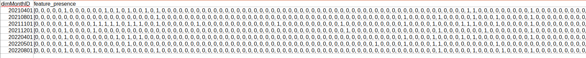

# PYSPARK DATA WRANGLING

***

# Description :-

This is a Jupyter Notebook to demonstrate how PySpark can be used to read and write data and make transformations on
health insurance claims data (diagnoses, services, procedures & rx from medical, behavioral & rx claims).

The notebook **PySpark_Data_Wrangling.ipynb** has the code and intermediate output. 
The folder **memid=46** is the output of one member. 

# Data used :-

* **Claims data i.e. Consumption data of members :-** 
  * Diagnoses  (from Medical and Behavioral Claims), 
  * Services   (from Medical and Behavioral Claims), 
  * Procedures (from Medical Claims),
  * Pharmacy   (from Pharmacy Claims)
* **Feature Ids**

# Sample output screenshot

 